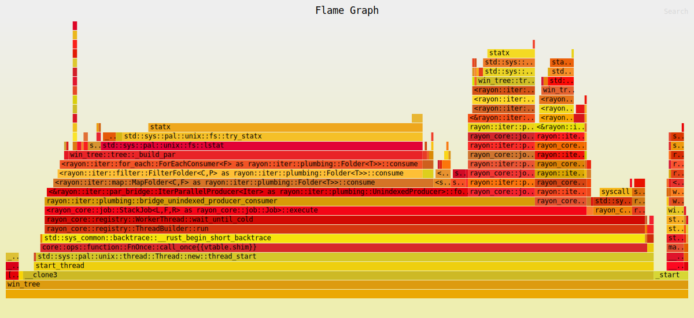

# Win Tree
A program to get the tree structure information of given directory in a recursive manner. This is same as [Windows `tree` command](https://learn.microsoft.com/en-us/windows-server/administration/windows-commands/tree) hence the name `win_tree` except that this supports json formating, depth control and filtering of files based on pattern matching on names. 

# Performance
- **[No support for Symlinks]** Program uses `fs::symlink_metadata` which translates to unix's `lstat` command which is ~10-15% faster that `stat` command as the former does not follow symlinks.
- Reducing `lstat` system call to only once per path

- Using `rayon` to parallely trigger tasks for each path.

# Usecase
This command is useful for scenarios where making a complete backup of complete data is too expensive hence a snapshot of the file structure tree can be taken and backed up so that atleast the names of the files is available and those files can be fetched again oif needed. (I am using this to create snapshot on a daily basis of my external 8 TB drive that holds all my media.)

# Arguments 
- [Mandatory] Path - Must always be the first argument.
- [Optional] Depth - [-d <number>] Controls how deep to go to generate the tree. Note that if there are children of a directory which are not included in the tree due to depth control then `size_in_bytes` for those directories and cascadingly for all their parent directories would be null as reporting them  without evaluating children would be incorrect.
- [Optional] Exclude - [-e <regex_pattern>] Controls which paths to exclude from snapshot.
- [Optional] Build Method - [-m <method_name>] Controls which method will be used to build the tree. Following options are there -
  - serial-async - No parallelisation, recursive implementation.
  - par-rayon - Parallellisation with rayon's `par_bridge` on `read_dir` iterator, recursive implementation. **[This gives results fastest]**.

# How to use
Via crates - [win_tree](https://crates.io/crates/win_tree).
```
# [Install cargo](https://doc.rust-lang.org/cargo/getting-started/installation.html)
- `cargo install win_tree`
- `win_tree <path> -d <depth> -e "<pattern>" > snapshot.json`
```

# Local results
## Single threaded build and build-async
Result on running on my external HDD with cap 8 TB and having data of ~4.2 TB across ~15600 files - Built snapshot in 74.27 seconds.
```
saurabh@Saurabh-Raider:/mnt/d/Saurabh/Personal/rust_labs$ cargo run -p win_tree -- /mnt/f/stuff/ -e "^(?:\..*|doc|debug)" -m serial-async > snapshot.json
warning: virtual workspace defaulting to `resolver = "1"` despite one or more workspace members being on edition 2021 which implies `resolver = "2"`
note: to keep the current resolver, specify `workspace.resolver = "1"` in the workspace root's manifest
note: to use the edition 2021 resolver, specify `workspace.resolver = "2"` in the workspace root's manifest
note: for more details see https://doc.rust-lang.org/cargo/reference/resolver.html#resolver-versions
    Finished `dev` profile [unoptimized + debuginfo] target(s) in 0.36s
     Running `target/debug/win_tree /mnt/f/stuff/ -e '^(?:\..*|doc|debug)'`
Built in **74.273552703s**
Serialised in **134.912809ms**
```

## Multi threaded build-par using rayon
Result on running on my external HDD with cap 8 TB and having data of ~4.2 TB across ~15600 files - Built snapshot in 17.88 seconds.
```
saurabh@Saurabh-Raider:/mnt/d/Saurabh/Personal/rust_labs$ cargo run -p win_tree -- /mnt/f/stuff/ -e "^(?:\..*|doc|debug)" -m par-rayon > snapshot.json
warning: virtual workspace defaulting to `resolver = "1"` despite one or more workspace members being on edition 2021 which implies `resolver = "2"`
note: to keep the current resolver, specify `workspace.resolver = "1"` in the workspace root's manifest
note: to use the edition 2021 resolver, specify `workspace.resolver = "2"` in the workspace root's manifest
note: for more details see https://doc.rust-lang.org/cargo/reference/resolver.html#resolver-versions
    Finished `dev` profile [unoptimized + debuginfo] target(s) in 0.36s
     Running `target/debug/win_tree /mnt/f/stuff/ -e '^(?:\..*|doc|debug)'`
Built in 17.884196059s
Serialised in 149.379899ms
```

## ~~[Method removed because of significantly worse performance among other methods] Multi threaded build-par using custom written threadpool~~
This was quite complex to achieve and does not produce better results. The reason for completing this was purely learning how it can be done. There are following steps of thinking about this logic -
- **Pure functions -**
  - Jobs running in threadpool must be pure functions.
  - This required modifying the unit function working on single path.
  - Shared memory was used for config options as well as parent pointers.
  - Config was read only so copyable data was used and parent was writable (for linking children and updating size) so was put behind a Arc<Mutex<_>>.
- **Job enqueueing -**
  - Adding jobs to a threadpool for a recursive operation where one job can produce more jobs was not intuitive to me. Thanks to the answer in [this stackoverflow](https://stackoverflow.com/a/78590982/2555504) question, I realised that we should put the logic of enqueuing new jobs within the job itself.
- **Memory management, Reference Counting and Producing result -**
  - In a nutshell, we are creating these TreeNodes which have references to both their parents and children and can be updated at any time and all of this is being done by n number of threads in a pool concurrently.
  - All of this is simple if we we just keep all shared references behind Arc<Mutex<_>> and update them as and when needed. The tricky part is to take the nodes which are ready out of the <Mutex> lock and <Arc> wrapper when all the jobs are done, for the purpose of sharing the result to the caller.
  - One option is to wait for all jobs to complete and then traverse the whole tree of wrapped objects and and create a clone with the inner objects. This approach has two problems - extra memory usage for cloning and extra time taken by serial execution of traversal.
  - Instead I used an approach which relied on Arc design fundamentals, which is reference count. For each node processing, I used `Arc::try_unwrap()` function to decide if the node has no more children which will be the case if all the children has completed their processing and dropped their reference to the parent. Using this, I was able to take the node out of Arc and Mutex wrappers and sent into a result channel which caller can consume.
  - A good read - https://doc.rust-lang.org/book/ch15-06-reference-cycles.html.

Result on running on my external HDD with cap 8 TB and having data of ~4.2 TB across ~15600 files - Built snapshot in 298.82 seconds.
```
saurabh@Saurabh-Raider:/mnt/d/Saurabh/Personal/rust_labs$ cargo run -p win_tree -- /mnt/f/stuff/ -e "^(?:\..*|doc|debug)" -m par-tp > target/snapshot.json
warning: virtual workspace defaulting to `resolver = "1"` despite one or more workspace members being on edition 2021 which implies `resolver = "2"`
note: to keep the current resolver, specify `workspace.resolver = "1"` in the workspace root's manifest
note: to use the edition 2021 resolver, specify `workspace.resolver = "2"` in the workspace root's manifest
note: for more details see https://doc.rust-lang.org/cargo/reference/resolver.html#resolver-versions
   Compiling win_tree v0.1.3 (/mnt/d/Saurabh/Personal/rust_labs/win_tree)
    Finished `dev` profile [unoptimized + debuginfo] target(s) in 16.82s
     Running `target/debug/win_tree /mnt/f/stuff/ -e '^(?:\..*|doc|debug)' -m par-tp`
Built in 298.828725846s
Serialised in 155.544688ms
```